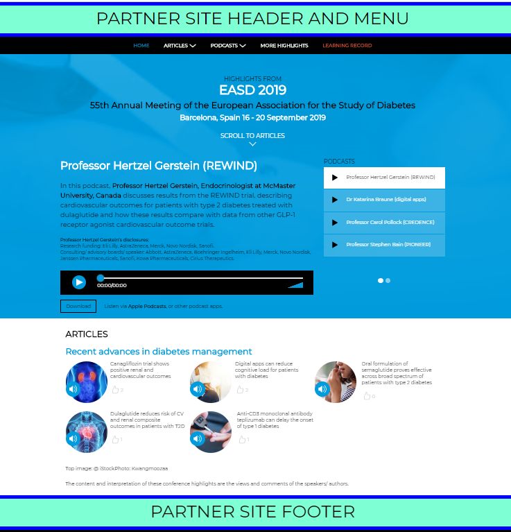

# Sharing M3 content with Partners

## Contents

- [Introduction](#introduction)
- [Overview of Oauth 2.0 solution](#overview-of-oauth-20-solution)
- [Header/Footer (optional)](#header-footer--optional-)
- [Reporting](#reporting)
- [Overview of signed URLs solution](#overview-of-signed-urls-solution)
* [Oauth 2.0 Technical Implementation](#oauth-20-technical-implementation)
  - [Introduction](#introduction-1)
  - [OAuth Authentication Flow](#oauth-authentication-flow)
  - [API Specification](#api-specification)
* [Signed URLs Technical Implementation](#signed-urls-technical-implementation)

## Introduction

The purpose of this document is to outline two solutions for enabling M3 content to be shared with verified users of partner communities.

The two solutions are:

1. Oauth 2.0
2. Signed URLs

The first half of this document will give a general overview of the two solutions on offer which should provide enough to decide on which option is most appropriate. The second half then gives detailed implementation details for each.

## Overview of Oauth 2.0 solution

The first proposal is to utilise the Oauth 2.0 standard to share specific pieces of M3 content with users of a partner community in a way that is secure and enables M3 to accurately track engagement.

Principles of this approach:

- Partner users do not need to register with M3
- Partner users will only have access to specific agreed pieces of content, they are not granted access to M3 websites as a whole
- Agreed set of user profile information is shared with M3 for reporting purposes only, but never enough to personally identify a user

Detailed documentation of the Oauth flow and work needed to implement it can be found later in this document, but the below illustration gives a simplified view of the flow.

<p align="center">

</p>

If the partner user is already logged into the partner site the flow below will be invisible to the user and happen "behind the scenes". If not already logged in the user will be interrupted with the partner site login form after the first step.

## Header/Footer (optional)

There is the option of wrapping the M3 content inside a partner header and footer. This gives the user the impression that they are moving to another area of the partner's site. To acheive this M3 requires the partner to provide separate API endpoints which return the HTML of the header or the footer as requested.

This also provides the user a means to get back to the partner website.

If the partner header/footer is static, i.e. has no personalisation and is the same for all user, the HTML can simply be provided to M3 by the partner prior to content being published (no API endpoints needed).

<p align="center">

</p>

## Reporting

As a minimum M3 will report on total engagement (impressions and clicks) and unique user engagement, and the only requirement for this to be possible is for a unique ID to be sent for each user as part of the Oauth flow.

For more detailed reporting M3 requires extra information to be passed, these are known as "scopes". The below defines typical scopes that can be used:

| Scope       | Description                                                                                                                                                                  |
| ----------- | ---------------------------------------------------------------------------------------------------------------------------------------------------------------------------- |
| `User ID`   | A unique ID per user, may be a string or number                                                                                                                              |
| `Specialty` | The user's medical specialty                                                                                                                                                 |
| `Seniority` | The user's medical seniority                                                                                                                                                 |
| `Country`   |
| `Doctor`    | True or False. Useful for distinguishing staff/test accounts for example                                                                                                     |
| `Groups`    | This allows an arbitary list of tags to be assigned to a user. Can be useful if custom reporting is required that can't be satisfied by the above, for example by age groups |

It is important that whatever info is transfered isn't enough to personally identify anyone. For example if postcode was passed in groups this may be fine on it's own, but in combination with user specialty it may become enough to find someone's identity.

## Overview of signed URLs solution

For partners that don't already have Oauth 2.0 capabilities it can be quite an undertaking to implement, therefore M3 offers signed URLs as a much simpler option.

In this approach the partner site generates urls for M3 content which have a special encoded token within them (e.g.  `https://partnerauth.m3medical.com/campaign?t=ewoJIlBhcnRuZXIiOiJQQVJUTkVSSUQiLAkJCQkJCQkJKiByZXF1=`), then redirect the user there.

The token part would have a digital signature generated with a secret key provided by M3, meaning as long as the secret is kept securely M3 can verify that the user has arrived via the partner site. It also contains a unique identifer per user so M3 can report on user engagement accurately.

Each token would only be valid for a short period of time, which is designed to prevent users sharing links. If M3 detects an expired token, the user will be redirected back to the partner site where a fresh token and redirect url can be generated.

An overview of this flow can be seen in the diagram below.

<p align="center">

</p>

# Oauth 2.0 Technical Implementation

## Introduction

Authentication is handled using the OAuth 2.0 specification. OAuth is an open standard designed to enable users to authenticate themselves on site A using their existing account on site B. This is ideal for the scenario of sharing M3's content with partner communities.

The OAuth authentication flow uses a number of user‑agent redirects, passing data using query parameters and a server‑to‑server request to establish a login session. Visualising the flow can be difficult, so below is a sequence diagram showing the full flow of a non‑logged‑in user landing on M3 content for the first time.

## OAuth Authentication Flow

We will first consider the case where a user arrives without a session on the client. The steps required to establish a session on the M3 Client can
be summarised by the following points:

1. Create a cookie‑based session on the partner OAuth provider.
2. Pass an auth_code to the M3 OAuth Client from the Partner Provider via user‑agent redirect.
3. Make a server‑to‑server request from the M3 OAuth Client to the provider to exchange the auth_code for an
   access_token .
4. Make a server‑to‑server request from the M3 OAuth Client to the provider to get the user profile using the
   access_token .
5. Create a cookie‑based session on the M3 Client.

<p align="center">

</p>

## API Specification

To enable all of the above the Partner needs to implement the following API endpoints:

| Method | Url              | Description                                                                                                                                                                                                              |
| ------ | ---------------- | ------------------------------------------------------------------------------------------------------------------------------------------------------------------------------------------------------------------------ |
| `GET`  | `/oauth/auth`    | If the M3 client finds that the user has no valid session, then it will redirect the user to the PP Authorise endpoint.                                                                                                  |
| `POST` | `/oauth/token`   | After the PP has redirected the user to the M3OC callback endpoint, a server‑to‑server request will be made to exchange the provided auth_code for a valid access_token . The POST body will be sent with form encoding. |
| `GET`  | `/oauth/profile` | Returns scoped profile information                                                                                                                                                                                       |
| `GET`  | `/api/header`    | (OPTIONAL) Serves the site header as a snippet of HTML that can be inserted into any page                                                                                                                                |
| `GET`  | `/api/footer`    | (OPTIONAL) Serves the site header as a snippet of HTML that can be inserted into any page                                                                                                                                |

# Signed URLs Technical Implementation

In order to grant access to M3 content the partner site must generate a JSON Web Token (JWT) which is added to the query string of a url.

M3 will provide the url and secret key to partner.

The token consists of an expiry date (recommended token lifespan will be confirmed by M3), and a simple JSON object containing as a minimum a unique user id. Extra information can be passed for reporting purposes, this will be agreed according to the needs of the specific partner integration.

Below shows how this can be acheived in Javascript (specifically NodeJS). M3 can provide examples for most of the main programming languages if needed.

```javascript
const jwt = require("jsonwebtoken");

const secretkey =
  "f16285efc6d874b192914b7e88144cf4ba36c9dccc78b30a36d82da2dd6d79054af9152abce8c7d4ca6c219170265c5f968e1821c6851274b04fe02e3e04ebe3";

const payload = {
  partnerid : 1 // provided by M3
  userid: "12345", // required
  specialty: "Gastroenterology", // optional
  extra: ["doctor", "male"] // optional, array of extra information
};

const token = jwt.sign(payload, secretkey, { expiresIn: "1h" });

const m3Url = `https://partnerauth.m3medical.com/campaign?t=${token}`;
```
